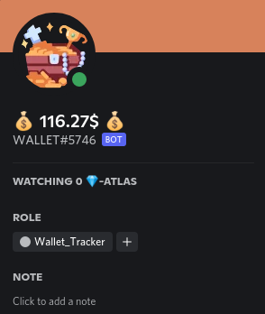

# discord_solana_wallet_tracker
A Simple Solana-Balance Asset-Tracker




# 1. Setup
1. edit: `<path-to-repo>` in `dc_walletBot.service`
2. create a file .env with the content:
   ```
    DISCORD_TOKEN="<your-DC-Token>"
    DISCORD_BOT_NAME="WALLET"
    DISCORD_WALLET_ADDRESS="<solana-wallet-address>"
   ```
3. edit `token-list.json` to set token-balances to be checked


# 2. Installl 
1. `mv ./dc_walletBot.service /etc/systemd/system/`
2. `sudo systemctl daemon-reload`
3. `sudo systemctl enable dc_walletBot.service`
4. `sudo systemctl start dc_walletBot.service`
5. `sudo systemctl status dc_walletBot.service`


# DEV
using Python3

1. Create venv: `python3 -m venv venv`
2. Activate venv: `source venv/bin/activate`
